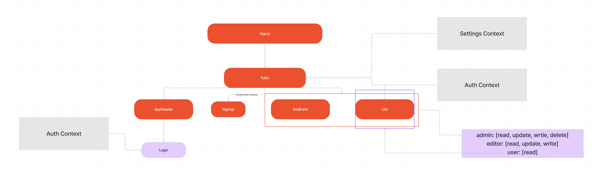

# To Do List Manager

  Project Goal: Implement use context API to create a task management tool & Utilize Mantine for styling and visual components

  This app will securely manage a to do list and persist tasks within a database. Secure routes will be used to provide users with role based access control. This application utilizes functional components, setting delivered to application using Context, use login & permissions delivered to the Context, local storage for login and user preferences. Axios will be used for API requests and developed using TDD & CI/CD. This app is also deployed to a cloud provider

## Author: Elaine Huynh

## Start Instructions
  - npm i uuid @mantine/core @mantine/hooks @emotion/react axios react-router-dom react-if

## UML

## Phases

  Phase 1: Application Setup
    Basic To Do List Management, using Hooks
    - Refactor To Do Application built by another team
      - modularize the application and utilize Mantine API to style application
  Phase 2: Persistence
    - Add basic application settings - how many items to show at once and whether or not to show completed items
    - Provide a form for users to change settings
      - Add user preferences to local storage and retrieve preferences from storage and apply to application on startup
  Phase 3: Settings and Global Context
    - Extend functionality by requiring users to be logged in to view to do list items
    - Implement role-based access control using user types
    - Create a login form on the header of the page. 
  Phase 4: Authorization
    - Use an API to persist task and user data instead of state. 
      - Fetch and store current list of items from a database 
        - In this scenario, we will be making requests on page load and when a task is added/deleted/edited
      - When users sign in, store the token recieved from the request to state as well as a cookie for later reference
      - User auth middleware to add another layer of protection so permitted users can make requests to POST/UPDATE/DELETE

